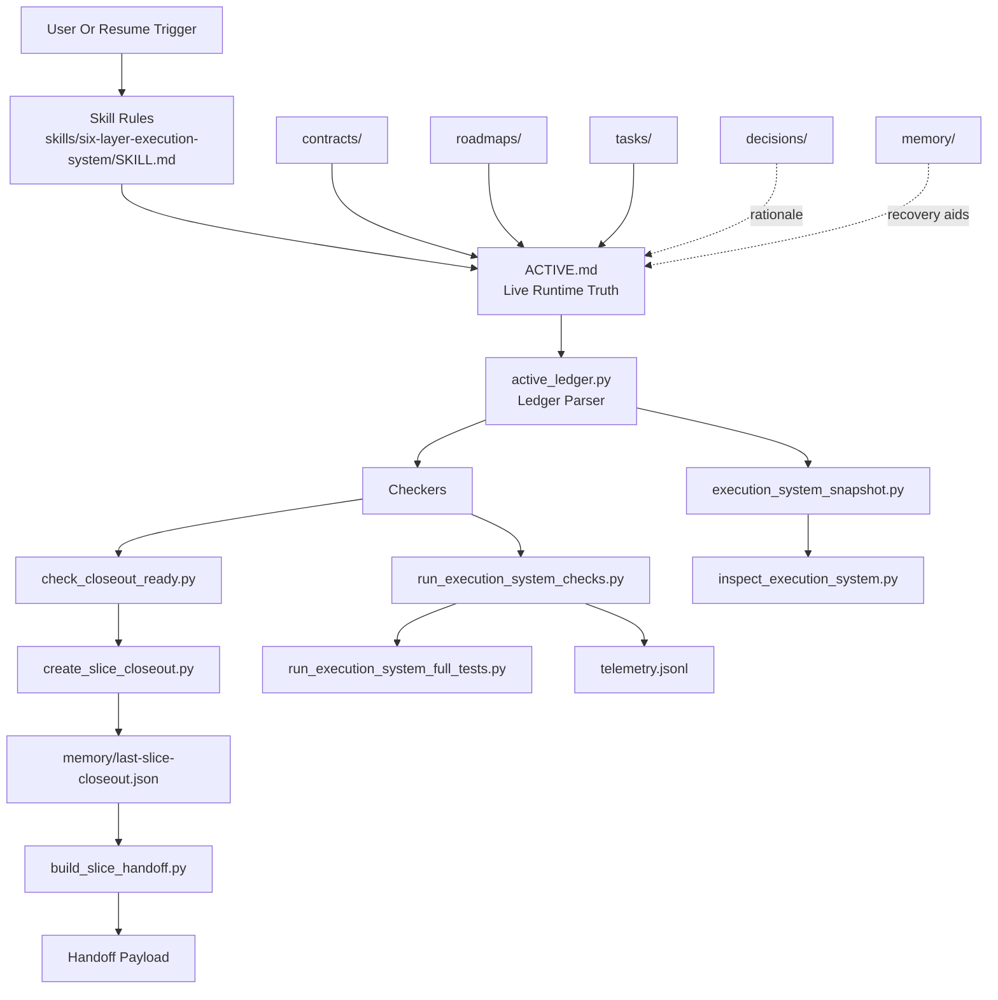

# 架构总览

## 1. 系统定位

这个仓库中的 subject root 不是仓库根，而是 `plugins/six-layer-execution-system/`。插件目录本身同时承载：

- 运行态真相
- 执行协议
- 校验器
- closeout / handoff 流程
- 插件分发元数据

因此它更像一个 **自解释、自校验、自交付的执行系统插件**，而不是普通的 Python 包或单体应用。

## 2. 核心设计原则

### 2.1 单一真相源

- `ACTIVE.md`：唯一 live runtime truth
- `skills/six-layer-execution-system/SKILL.md`：唯一 prompt 规则真相
- closeout artifact：唯一切片完成真相
- `references/`：仅供辅助，不提供最终事实

### 2.2 Focus-first

- 多 activity 可以并存
- 默认只允许 `current_focus_activity_id` 对应的 activity 自动推进
- 非 focus activity 仅用于恢复、展示状态、维护上下文

### 2.3 显式完成协议

系统不把“跑绿了”直接等价成“已完成”。切片完成必须显式落到 closeout artifact，并携带：

- `validation_state=validated`
- `slice_state=closed_out`

### 2.4 插件可迁移

- 插件目录复制后即可使用
- repo 根 `tests/` 属于 source checkout 开发资产
- standalone plugin 不要求携带完整测试目录

## 3. 六层结构

## 4. 分层职责关系

### 4.1 Contract 层

- 负责稳定约束与不变量
- 典型文件：`contracts/execution-system-contract.md`
- 回答“什么长期成立”
- 不记录当前 focus、当前 slice、日常进度

### 4.2 Roadmap 层

- 负责 phase 级计划与退出条件
- 典型文件：`roadmaps/execution-system-spec-v1-roadmap.md`
- 回答“按什么阶段推进”
- 不替代运行态

### 4.3 Tasks 层

- 负责 slice 级拆分和执行设计
- 典型文件：`tasks/execution-system-decomposition-upgrade-tasks.md`
- 可表达 `depends_on`、`parallel_safe`、`shared_write_targets`、`rollback_strategy`
- 回答“当前阶段应该如何拆”

### 4.4 ACTIVE 层

- 负责当前 focus、活动索引、活动卡片、恢复指针
- 典型文件：`ACTIVE.md`
- 回答“现在在做什么”
- 是所有恢复、状态汇报、closeout 入口的第一真相源

### 4.5 Decisions 层

- 负责 durable rationale
- 典型文件：`decisions/runtime/2026-03-13-execution-system-focus-first.md`
- 回答“为什么做了这个长期选择”

### 4.6 Memory 层

- 负责恢复辅助、工作缓冲、closeout 产物
- 典型文件：
  - `memory/working-buffer.md`
  - `memory/last-slice-closeout.json`
- 不能替代 `ACTIVE.md`

## 5. 运行时主流程

完整 Mermaid 流程图见：

- `complete-execution-flow.md`

### 5.1 恢复 / 状态查询流程

1. 读取 `ACTIVE.md`
2. 解析 `current_focus_activity_id`
3. 读取 focus activity 对应的 `source_doc / roadmap_doc / tasks_doc`
4. 做 repo/workspace fact check
5. 再决定回复内容或下一步动作

对应实现：

- `scripts/active_ledger.py`
- `scripts/execution_system_snapshot.py`
- `scripts/inspect_execution_system.py`

### 5.2 校验流程

1. 解析 ACTIVE 与 task docs
2. 运行 hard-fail checkers
3. 运行 advisory checks
4. 若能识别 source checkout 根 `tests/`，追加 repo smoke tests
5. 输出统一 summary footer
6. 记录 telemetry

对应实现：

- `scripts/run_execution_system_checks.py`
- `scripts/execution_system_suite.py`
- `scripts/telemetry.py`

### 5.3 切片 closeout / handoff 流程

1. 运行 `collect_summary()`，确认 hard-fail 通过
2. 运行 `check_closeout_ready()`，确认 focus/slice/commit/validation 信息齐全
3. 基于 focus activity 生成 `memory/last-slice-closeout.json`
4. 从 closeout artifact 生成 handoff payload
5. 输出 payload 给外部 host 或后续流程使用

对应实现：

- `scripts/check_closeout_ready.py`
- `scripts/create_slice_closeout.py`
- `scripts/check_slice_closeout.py`
- `scripts/build_slice_handoff.py`
- `scripts/complete_slice.py`

## 6. 活动模型

系统在 `ACTIVE.md` 中支持 3 类 activity：

| 类型 | 用途 | 特点 |
| --- | --- | --- |
| `roadmap` | 真实推进线 | 可关联 source/roadmap/tasks 文档，支持 slice、commit、validation |
| `waiting` | 等待线 | 说明等待对象与解阻条件，不应自动推进 |
| `simple` | 轻量活动 | 无复杂 roadmap/tasks，但有 goal / validation / done_definition |

当前 parser 与 checker 会对不同 activity type 应用不同字段约束。

## 7. 并行波次模型

系统默认是 focus-first，但在 focus activity 内允许 parallel-wave 执行。条件是：

- 只在 roadmap activity 上启用
- `execution_mode` 必须是 `parallel-wave`
- 必须显式声明：
  - `current_wave_id`
  - `ready_slices / inflight_slices / blocked_slices` 之一
  - `integration_step`
- tasks 层必须提供依赖和并行安全信息

相关校验器：

- `check_task_dependency_graph.py`
- `check_parallel_safety.py`
- `check_active_wave_state.py`

## 8. 内部依赖关系

### 8.1 基础模块

- `execution_system_paths.py`：路径与环境变量解析，是所有脚本的底座
- `plugin_paths.py`：把插件 wrapper 转发到本体脚本时，补齐环境变量

### 8.2 账本核心

- `active_ledger.py`：负责把 `ACTIVE.md` 解析成 `Ledger` / `Activity`

### 8.3 校验与执行编排

- `execution_system_suite.py`：集中定义 checker / advisory / tests registry
- `run_execution_system_checks.py`：统一 checker runner
- `run_execution_system_full_tests.py`：统一 full suite runner

### 8.4 closeout/handoff

- `check_closeout_ready.py`
- `create_slice_closeout.py`
- `check_slice_closeout.py`
- `build_slice_handoff.py`
- `complete_slice.py`

### 8.5 观测与工具

- `execution_system_snapshot.py`：系统快照
- `telemetry.py`：事件记录
- `exec_sys.py`：统一 CLI 工具

## 9. 外部依赖边界

运行时几乎只依赖 Python 标准库，但以下系统命令是事实上的外部依赖：

- `git`：用于 HEAD、commit 存在性、脏状态、测试初始化等
- `python3`：所有脚本入口

没有发现 `requirements.txt`、`pyproject.toml` 或其它第三方 Python 依赖描述文件，说明当前系统刻意保持 **零第三方运行时依赖**。
