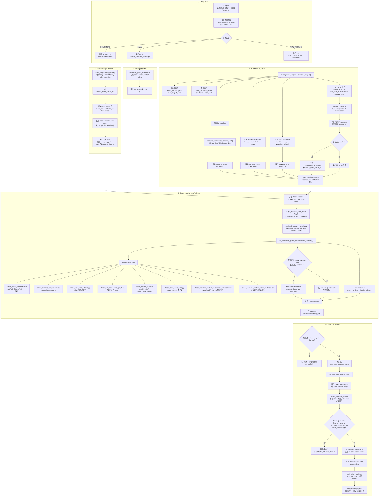

# 完整执行系统流程图

## 1. 说明

这张图把当前插件里的完整执行链放到一张图里，覆盖：

- 新请求 / 恢复请求 / inspect 请求入口
- `ACTIVE.md` 驱动的 focus-first 恢复链
- 自然语言需求一键分解链
- checks / smoke tests / telemetry 链
- closeout / handoff 链

其中最重要的边界是：

- `ACTIVE.md` 仍然是唯一 live runtime truth
- `activities/<activity-id>/0-demand.md` 是上游 intake 工件，不替代运行态真相
- `activities/<activity-id>/2-roadmap.md` 和 `3-tasks/` 承载执行设计，真正的当前执行状态仍落在 `ACTIVE.md`

如果需要更适合汇报的简化视图，见：

- `executive-flow-views.md`

## 2. 完整流程图

## 3. 节点与代码映射

| 流程节点 | 真实实现 |
| --- | --- |
| 账本解析 | `scripts/active_ledger.py` |
| inspect 快照 | `scripts/execution_system_snapshot.py`、`scripts/inspect_execution_system.py` |
| 需求分解入口 | `scripts/exec_sys.py` |
| 需求分解引擎 | `scripts/decomposition_engine.py` |
| demand schema / 渲染 | `scripts/demand_card.py`、`scripts/check_demand_card_schema.py` |
| checks runner | `scripts/run_execution_checks.py`、`scripts/run_local_execution_checks.py`、`scripts/run_execution_system_checks.py` |
| suite 注册表 | `scripts/execution_system_suite.py` |
| closeout / handoff | `scripts/complete_slice.py`、`scripts/create_slice_closeout.py`、`scripts/build_slice_handoff.py` |
| full suite | `scripts/run_execution_system_full_tests.py` |

## 4. 读图重点

- 如果入口是“恢复 / 继续”，系统先走 `ACTIVE.md`，不是先看 roadmap。
- 如果入口是“新自然语言需求”，系统先生成 `activities/<activity-id>/ + ACTIVE activity`，再进入 canonical checks。
- `--activate` 只影响 focus 切换，不改变 demand/roadmap/tasks 的生成结构。
- `closeout` 不直接依赖实时 `ACTIVE.md` 输出 payload，而是先冻结到 `local-state/last-slice-closeout.json`，再从 frozen artifact 生成 handoff。
