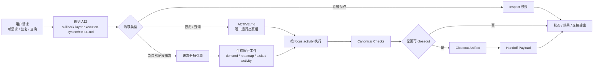
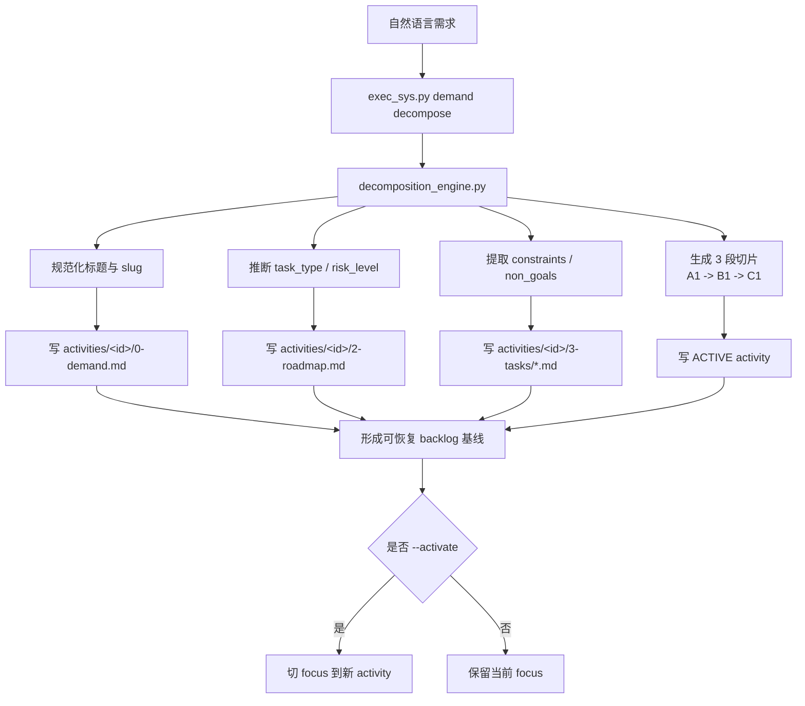
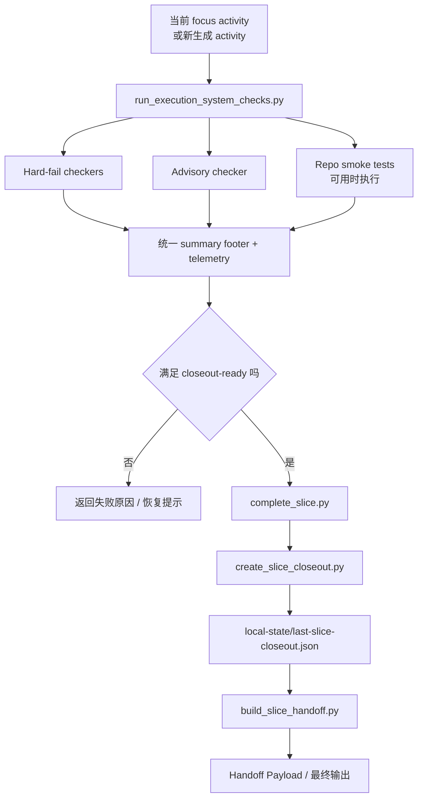

# 汇报版执行系统流程图

## 1. 用途

这份文档面向汇报、评审和交接，不追求把所有脚本节点一次性展开，而是把完整执行系统压缩成 3 张更易讲解的图：

- 总览图：系统从请求进入到交付输出的主链
- 需求分解图：自然语言需求如何落成 `demand / roadmap / tasks / ACTIVE`
- 执行交付图：checks、closeout、handoff 如何形成可验证闭环

如果需要工程级细图，继续看：

- `complete-execution-flow.md`

## 2. 汇报总览图

## 3. 需求分解汇报图

## 4. 执行与交付汇报图

## 5. 讲解口径

- 第一张图用于讲“系统边界”和“主链闭环”。
- 第二张图用于讲“新增能力”，也就是自然语言需求自动分解。
- 第三张图用于讲“为什么这套系统是生产级的”，因为它不是只生成文档，而是带 checks、ready gate、closeout artifact 和 handoff payload。

## 6. 与真实代码的对应关系

| 汇报节点 | 真实实现 |
| --- | --- |
| 规则入口 | `skills/six-layer-execution-system/SKILL.md` |
| 运行态真相 | `ACTIVE.md` |
| 需求分解引擎 | `scripts/exec_sys.py`、`scripts/decomposition_engine.py`、`scripts/demand_card.py` |
| checks | `scripts/run_execution_system_checks.py`、`scripts/execution_system_suite.py` |
| closeout | `scripts/complete_slice.py`、`scripts/create_slice_closeout.py` |
| handoff | `scripts/build_slice_handoff.py` |
| inspect | `scripts/execution_system_snapshot.py`、`scripts/inspect_execution_system.py` |
